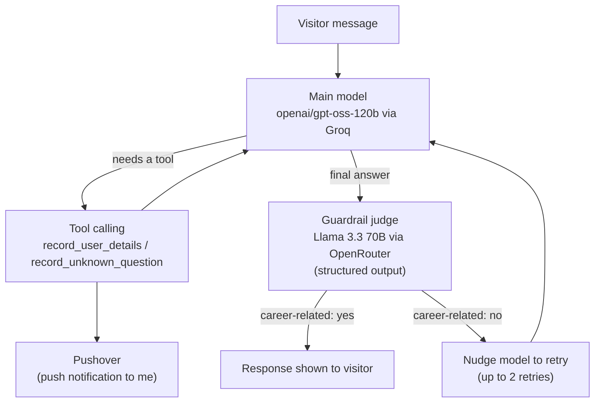

# 🤖 Career-Agent (Digital Twin)

> A conversational AI agent that acts as my "digital twin" — it answers questions about my career, background, and skills on my behalf, so recruiters and collaborators can get quick, accurate answers even when I'm not available to chat directly.

**Live demo:** [career-agent-k7lt.onrender.com](https://career-agent-k7lt.onrender.com/)
*(Hosted on Render's free tier — the server sleeps after inactivity, so the first load may take 30–60 seconds to wake up.)*

---

## 🧠 How It Works



- **Main conversation model** — `openai/gpt-oss-120b`, served via the Groq API, with a system prompt built from my resume and LinkedIn profile as grounding context.
- **Guardrail / judge model** — every response is checked by a separate call to Llama 3.3 70B Instruct via OpenRouter, using a Pydantic-constrained structured output that classifies the reply as career-related or not. Off-topic replies trigger a corrective re-prompt, up to 2 retries, before the agent gives up gracefully instead of answering off-topic questions.
- **Tool calling** — the agent can call functions to (1) record a visitor's name and email once they've explicitly provided them and expressed interest in getting in touch, and (2) log any question it couldn't answer so the knowledge base can be improved later. Both are pushed to my phone in real time via Pushover.
- **Interface** — a Gradio `ChatInterface` with custom CSS/JS and example prompts for a more polished chat experience than the Gradio default.

## 🛠️ Tech Stack

| Component | Technology |
|---|---|
| UI | Gradio `ChatInterface`, custom CSS/JS |
| Main chat model | `openai/gpt-oss-120b` via the Groq API |
| Guardrail / judge model | Llama 3.3 70B Instruct via OpenRouter, structured outputs |
| Structured output schema | Pydantic |
| Notifications | Pushover API |
| PDF parsing | pypdf |
| Config | python-dotenv |

## 📁 Project Structure

```text
Career-Agent/
├── app.py              # Gradio app, main chat loop, tool-call loop, guardrail logic
├── context.py           # Builds the system prompt from resume/LinkedIn/summary
├── tools.py             # Tool definitions + handlers (Pushover notifications)
├── models.py             # Pydantic schema for the judge's structured output
├── styles.py             # Custom CSS/JS and example prompts for the Gradio UI
├── Danish_Arshid.pdf     # Resume — parsed at startup for context
├── linkedin.pdf          # Exported LinkedIn profile — parsed at startup for context
├── summary.txt           # Short hand-written background summary
└── requirements.txt
```

## 🔁 Guardrail Retry Flow

Rather than trusting the main model to always stay on-topic, every response passes through a second, independent LLM call before it's shown to the visitor:

```text
1. Main model produces a candidate response
2. Judge model classifies it: career-related? yes / no
3. If "no" and retries < 2:
     - Append the failed response + a correction message to the conversation
     - Ask the main model to try again
4. If "no" after 2 retries:
     - Return a fixed fallback message instead of looping forever
5. If "yes":
     - Return the response to the visitor
```

This keeps the agent on-topic without hard-coding keyword filters — the judge model reasons about the actual content of the reply.

## 📚 Knowledge Base

`context.py` builds the agent's system prompt from three source files at startup:

- `Danish_Arshid.pdf` — resume, parsed with `pypdf`
- `linkedin.pdf` — an exported copy of the LinkedIn profile, parsed with `pypdf`
- `summary.txt` — a short hand-written summary of background

Their extracted text is injected directly into the system prompt, so answers are grounded in these documents rather than invented. These files are required for the app to run — removing them will break both the local and deployed versions.

## ⚡ Setup (run locally)

1. Clone the repo and install dependencies:
   ```bash
   pip install -r requirements.txt
   ```
2. Create a `.env` file in the project root with:
   ```env
   GROQ_API_KEY=your_groq_key
   OPENROUTER_API_key=your_openrouter_key
   PUSHOVER_USER=your_pushover_user_key
   PUSHOVER_TOKEN=your_pushover_app_token
   ```
3. Run the app:
   ```bash
   python app.py
   ```
   This launches a local Gradio interface in your browser.

## 🐳 Deployment

Deployed on [Render](https://render.com) as a web service, with the same environment variables configured in the Render dashboard instead of a local `.env` file.

## 💡 Why I Built This

I wanted to explore practical multi-agent patterns beyond a single prompt-response loop — specifically, using a second model as a guardrail/judge with structured outputs, and giving an agent real tool-calling ability with side effects (push notifications) rather than just retrieval. It's also genuinely useful as a first point of contact for anyone looking into my background.

## 🔮 Possible Next Steps

- Add retrieval over my resume/projects instead of stuffing everything into the system prompt
- Add automated tests for the guardrail logic
- Move off Render's free tier (or add a keep-alive ping) to avoid cold-start delays on first load